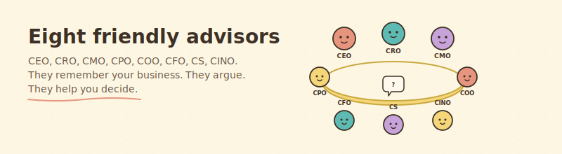
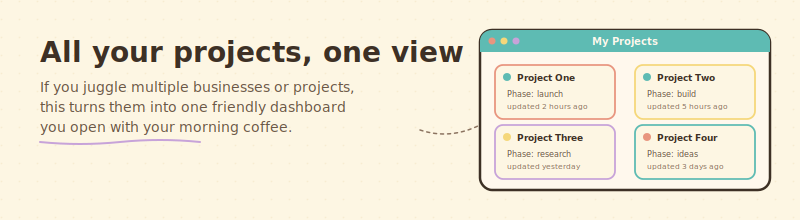

# ChaiTech AI Assistant

> A friendly home for ChaiTech founders who want to use AI but do not know where to start.

If you have never touched GitHub, have no idea what "Claude Code" is, and only know that everyone keeps saying you should try AI in your business — you are in exactly the right place. This page was built for you.

## Three things you can do here

 &nbsp;  &nbsp; 

### Learn

You have never used Claude for your work, and the tutorials online are either too short or written for engineers. Start with our plain-language guides. They explain what Claude is, what it can do for you, and how to install your first helper, with no jargon and no "just run this command" leaps.

Jump to: [Where do I start? (for complete beginners)](#where-do-i-start-if-i-have-never-done-this-before)

### Use

We include four ready-made helpers (the technical word is "skills") that cohort founders use in their own work. Each one is two copy-paste steps to install. Pick one, install it, and Claude starts doing that thing for you.

Jump to: [What is inside today](#what-is-inside-today)

### Ask and share

Have a question you were embarrassed to ask in the group session? Ask it here. Built something small and clever? Share it here. No question is silly. No contribution is too small.

- **Ask a question:** [open a Discussion](https://github.com/protectyr-labs/chaitech-ai-assistant/discussions/new?category=q-a) (GitHub account required, free to create)
- **Share something you built:** see [How to share](CONTRIBUTING.md)
- **Not sure?** Open any question as a Discussion. Someone will point you to the right place.

---

## What is inside today

Four helpers live here right now. Each one is self-contained, free, and works without you signing up for anything extra.

###  &nbsp; Eight friendly advisors for your business

Imagine asking a Chief Revenue Officer "should I raise my prices?" and getting an answer rooted in your actual numbers, not a generic article. This helper gives you eight AI advisors (CEO, CRO, CMO, CPO, COO, CFO, CS, CINO) that know your business, speak in character, and argue with each other when you need a decision.

→ [See how this works](skills/executive-team-template/)

###  &nbsp; Your day, bracketed

Three small commands that shape your workday. In the morning you type `/daily-start` and Claude asks what today's focus is. When you finish something you type `/done` and it logs the win and suggests what to do next. At the end of the day you type `/daily-end` and Claude wraps up and seeds tomorrow.

→ [See how this works](skills/daily-rhythm/)

###  &nbsp; All your projects, one view

If you run more than one business or project at a time, this turns them into a single friendly dashboard. Freshness badges tell you what has been updated recently and what is going stale. Opens in your browser.

→ [See how this works](skills/multi-project-dashboard/)

###  &nbsp; Check before you push

Right before you push your code to GitHub, this helper reviews your pending changes and tells you what would break, what would leak, and what would make a future audit painful. It checks for the OWASP Top 10, hardcoded secrets, and SOC 2 relevance markers. Catches mistakes before they become public.

→ [See how this works](skills/secure-before-push/)

---

## Where do I start if I have never done this before?

Four gentle steps. Allow yourself an afternoon.

1. **Install Claude Code.** It is free. [Download and install guide from Anthropic.](https://docs.anthropic.com/en/docs/claude-code/overview)
2. **Pick one helper from above.** We recommend "Your day, bracketed" first. It is the smallest change and you will feel the benefit tomorrow morning.
3. **Follow the two steps in that helper's page.** Copy, paste, done.
4. **Come back with a question.** Open a Discussion or ask at the next cohort session. Both are fine.

If any of this feels like it is written in a language you do not speak, [open a Discussion](https://github.com/protectyr-labs/chaitech-ai-assistant/discussions) and say so. We will rewrite the page until it makes sense.

---

## Resources (workbooks, templates, things you can print)

Not every useful thing is a Claude Code skill. Some are workbooks, templates, or printables that help you do the work of building a startup. Those live in `resources/`.

- [Discovery Interview Workbook](resources/discovery-interview-workbook/) — printable HTML companion for Rob Kenedi's 40-interview customer discovery challenge. Verbatim script, branching scenarios for when calls go off-rails, pre-call briefing template, quick reference cards. Open in a browser, print for use during real calls.

→ [Browse all resources](resources/)

---

## Curated picks from the Claude community

Some of the most useful helpers for Claude were built by people outside our cohort. We point to them here with full credit to their authors. Nothing is duplicated. You install them from wherever their maker put them.

Five hand-picked skills live there now, covering research, workflow discipline, making your own skills, video production, and document generation.

→ [Browse all five curated picks](curated/)

---

## How to contribute

You do not need to be a coder.

- **Built something? Share it.** Even a short prompt you use every day is worth sharing. The [How to share](CONTRIBUTING.md) page walks you through it. Most contributions take ten minutes.
- **Have a question?** [Open a Discussion.](https://github.com/protectyr-labs/chaitech-ai-assistant/discussions) The community answers faster than you would expect.
- **Not sure if what you have is worth sharing?** Ask the steward (see below). If it helped you, it will help someone else.

---

## A note from the steward

Hi, I am Sasha Madaniev, a member of ChaiTech Cohort 7 and founder of Protectyr Security. I built this after the first Claude Code session our cohort had.

Too many of us left that session with the same question, "where do I find practical helpers?", and no shared answer existed. So I started one.

Today it lives on my Protectyr Labs portfolio. If ChaiTech decides to host it under the ChaiTech name, it moves. Either way, it belongs to the cohort founders who use it, contribute to it, and learn from each other through it.

If something here feels confusing or wrong, tell me. I want this page to be friendly first and technical second.

---

## Credits

Bryan Altman, for the session that made this idea obvious, and for the [claude-research-skill](https://github.com/altmbr/claude-research-skill) that is our first curated pick.

TÂCHES and the GSD community, for a workflow framework that sets the bar for what a Claude Code project can look like.

Anthropic, for the [official plugins](https://github.com/anthropics/claude-plugins-official) and the [public Agent Skills repo](https://github.com/anthropics/skills) that make everything else possible.

ChaiTech Accelerator Cohort 7, for being the kind of cohort where someone can stand up and say "I built a thing, want it?"

## License

MIT. Free to use, free to fork, free to share. See [LICENSE](LICENSE).
