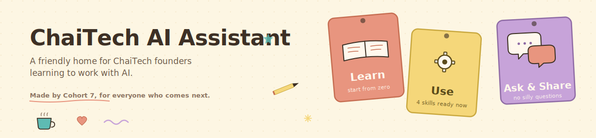
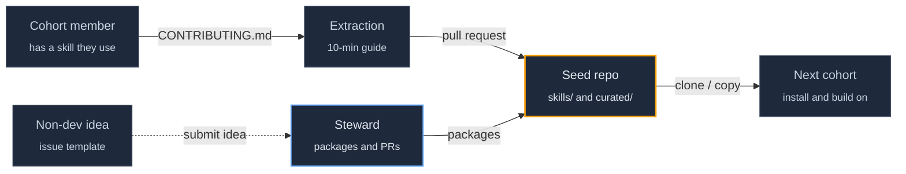

<div align="center">



</div>

# chaitech-claude-skills-seed

A shared library of Claude Code skills, agents, and templates, seeded by and for ChaiTech Accelerator Cohort 7.

[](LICENSE)
[](#status)
[](https://docs.anthropic.com/en/docs/claude-code)
[](CONTRIBUTING.md)

Every founder who tried Claude Code for the first time during Cohort 7 left with the same question: where do I find practical skills to install? Until now there was no shared answer. This repository is a starting point. Three seeded flagship skills, a 10-minute extraction guide, and an invitation for cohort members to contribute what they build.

## Quick start

```bash
git clone https://github.com/protectyr-labs/chaitech-claude-skills-seed.git
cd chaitech-claude-skills-seed

# install a skill into your Claude Code config
cp -r skills/daily-rhythm ~/.claude/skills/

# or into a specific project
cp -r skills/daily-rhythm /path/to/your-project/.claude/skills/
```

Then invoke the skill from Claude Code (for example the `/daily-start` command after installing `daily-rhythm`).

## Architecture



Two sections live side by side. `skills/` holds original contributions written specifically for this repo. `curated/` links to high-quality skills maintained elsewhere, with credit preserved. See [ARCHITECTURE.md](ARCHITECTURE.md) for the design rationale.

> [!NOTE]
> This is a seed repository. Three skills are included today. The whole point is for cohort members to add the next thirty.

## Seeded skills

| Skill | Category | What it does |
|---|---|---|
| [`executive-team-template`](skills/executive-team-template/) | Advisory | Eight-persona AI leadership team (CEO, CRO, CMO, CPO, COO, CFO, CS, CINO) with state files and participation rules. Fork for your own advisory board. |
| [`daily-rhythm`](skills/daily-rhythm/) | Workflow | Three commands that bracket the founder workday: `/daily-start`, `/done`, `/daily-end`. File-based, no external dependencies. |
| [`multi-project-dashboard`](skills/multi-project-dashboard/) | Visibility | Aggregates state across sibling project directories into one HTML command center with freshness indicators. |

## Curated external skills

A small, growing list of Claude Code skills maintained outside this repo that cohort members find useful. See [`curated/`](curated/) for the current list with credit and source links. The first entry is Bryan Altman's [`claude-research-skill`](https://github.com/altmbr/claude-research-skill).

## How to contribute

Read [CONTRIBUTING.md](CONTRIBUTING.md). The short version: copy a skill you already use from your local Claude Code config, scrub secrets and business specifics, write a short README, open a pull request. Most contributions take ten minutes.

Not a developer? Open an issue using the "Submit a skill idea" template and a steward will help package it.

## Design decisions

- **D-01: Two sections, one repo.** Original contributions live in `skills/`. External recommendations live in `curated/` as links with credit. We link rather than republish so authors keep control of their work.
- **D-02: Permissive licensing by default.** MIT across the repo. Individual contributed skills may declare a different permissive license; non-permissive licenses are rejected.
- **D-03: File-based examples.** The seeded skills deliberately avoid dependencies on external services. A founder can install and use them without signing up for anything.
- **D-04: Stewardship model.** One founding steward during Cohort 7 reviews pull requests and keeps the repo tidy. Future cohorts inherit the stewardship role through the program.
- **D-05: Sanitization is the bar.** Every contribution is scanned for secrets, client names, and private paths before merge. The scanner rejects leaks; the steward verifies context.

## Status

Version 0.1 seed. Three skills live, contribution pipeline open. The repository is currently hosted under [`protectyr-labs`](https://github.com/protectyr-labs) as interim home. If ChaiTech adopts the project, ownership transfers to a `chaitech` organization; the contributor history and license remain intact.

## Origin

Seeded by Alexander "Sasha" Madaniev, CISSP, during ChaiTech Accelerator Cohort 7 in April 2026. The original flagship skills were extracted from a production solo-founder operations system and sanitized for open source. No client data, no business secrets, fresh git history.

## Links

- [ARCHITECTURE.md](ARCHITECTURE.md) — design decisions and rationale
- [CONTRIBUTING.md](CONTRIBUTING.md) — 10-minute extraction guide
- [LICENSE](LICENSE) — MIT
