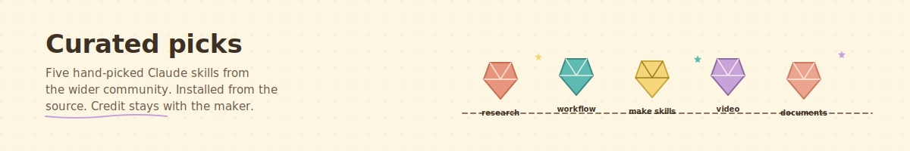

<div align="center">



</div>

# Curated picks from the Claude community

> Five hand-picked Claude skills from the wider community. Each one is maintained by its original author; you install it from the source, not from us.

## How a pick earns its spot

A skill lands on this page when:

1. A cohort member or the steward has actually used it in real work.
2. The author is still actively maintaining it.
3. The license allows others to install and use it.

That is the whole bar.

---

## The five picks

 &nbsp;  &nbsp;  &nbsp;  &nbsp; 

---

###  &nbsp; claude-research-skill

**By Bryan Altman** &nbsp;|&nbsp; [github.com/altmbr/claude-research-skill](https://github.com/altmbr/claude-research-skill)

Turns Claude into a tiny research team. You ask a question. It splits the question into smaller parts, sends each part to a different researcher, then brings everything back as one synthesized answer.

<details>
<summary><strong>When to use it</strong></summary>

- Market research for a new offering.
- Competitive analysis before a pricing change.
- Due diligence on a potential partner.
- Anything where you want more than a single ChatGPT search result.

</details>

<details>
<summary><strong>How to install it</strong></summary>

```bash
git clone https://github.com/altmbr/claude-research-skill.git
cp -r claude-research-skill ~/.claude/skills/
```

Then from Claude Code, ask Claude to research something using the skill.

</details>

<details>
<summary><strong>Why this is our first pick</strong></summary>

Bryan taught a Claude Code session to ChaiTech Cohort 7 on 2026-04-21. When asked "where do founders find practical Claude skills?", he shared this one as his personal favorite. It is the skill that sparked this whole repository.

</details>

---

###  &nbsp; GSD (Get Shit Done)

**By TÂCHES** &nbsp;|&nbsp; [github.com/gsd-build/get-shit-done](https://github.com/gsd-build/get-shit-done)

A full spec-driven development workflow on top of Claude Code. Project initialization, phased planning, execution, verification. Used by engineers at Amazon, Google, Shopify, and Webflow.

<details>
<summary><strong>When to use it</strong></summary>

- You want a disciplined project structure: research, plan, execute, verify.
- You like the idea of phases and checkpoints instead of "just vibe-code it."
- You want state that persists across conversations.

</details>

<details>
<summary><strong>How to install it</strong></summary>

```bash
npx get-shit-done-cc --claude --global
```

Other platforms supported: OpenCode, Gemini CLI, Kilo, Codex, Copilot, Cursor, Windsurf. Use `--[platform]` and `--global` or `--local`.

</details>

<details>
<summary><strong>Good to know</strong></summary>

Active Discord community: [discord.gg/mYgfVNfA2r](https://discord.gg/mYgfVNfA2r). Core commands: `/gsd-new-project`, `/gsd-plan-phase`, `/gsd-execute-phase`.

</details>

---

###  &nbsp; skill-creator

**By Anthropic** &nbsp;|&nbsp; [github.com/anthropics/claude-plugins-official](https://github.com/anthropics/claude-plugins-official)

Anthropic's own plugin for building Claude Code skills. If you want to create your own (and eventually contribute one back to this repo), skill-creator is where to start.

<details>
<summary><strong>When to use it</strong></summary>

- You have an idea for a skill but do not know what files to create.
- You want guardrails on structure, naming, and metadata.
- You want to measure whether your skill description actually triggers at the right time.

</details>

<details>
<summary><strong>How to install it</strong></summary>

From Claude Code:

```
/plugin install skill-creator@claude-plugins-official
```

Or browse the full official plugin collection at the link above.

</details>

<details>
<summary><strong>Good to know</strong></summary>

The same marketplace also ships `code-review`, `frontend-design`, `playwright`, and `superpowers`. If you like skill-creator, those are also worth a look.

</details>

---

###  &nbsp; claude-code-video-toolkit

**By Digital Samba** &nbsp;|&nbsp; [github.com/digitalsamba/claude-code-video-toolkit](https://github.com/digitalsamba/claude-code-video-toolkit)

An AI-native video production workspace for Claude Code. Skills, commands, templates, and tools for creating explainer videos, product demos, walkthroughs, and presentations with Remotion under the hood.

<details>
<summary><strong>When to use it</strong></summary>

- You want to make a product explainer video without hiring a video editor.
- You want Claude to help you go from concept to final render.
- You want programmatic video (Remotion, Manim) rather than a stock template library.

</details>

<details>
<summary><strong>How to install it</strong></summary>

```bash
git clone https://github.com/digitalsamba/claude-code-video-toolkit.git
```

Follow the project's own README for the full setup. The toolkit includes its own skills, templates, and example projects.

</details>

<details>
<summary><strong>Good to know</strong></summary>

If you want a lighter-weight alternative, see also [wilwaldon/Claude-Code-Video-Toolkit](https://github.com/wilwaldon/Claude-Code-Video-Toolkit). Both are active.

</details>

---

###  &nbsp; anthropics/skills — document creation

**By Anthropic** &nbsp;|&nbsp; [github.com/anthropics/skills](https://github.com/anthropics/skills)

Anthropic's public repository for Agent Skills. Inside it, the `skills/docx`, `skills/pdf`, `skills/pptx`, and `skills/xlsx` subfolders power Claude's ability to build real documents. Perfect for founders who want Claude to produce investor updates, client reports, pitch decks, and spreadsheets.

<details>
<summary><strong>When to use it</strong></summary>

- You need a PDF audit report, a Word-formatted investor update, or a PowerPoint pitch deck.
- You want Claude to fill in a template automatically from your data.
- You want the output to be real Office formats, not just markdown or HTML.

</details>

<details>
<summary><strong>How to install it</strong></summary>

Clone the repo and copy the subfolder(s) you need:

```bash
git clone https://github.com/anthropics/skills.git
cp -r skills/pdf ~/.claude/skills/
cp -r skills/docx ~/.claude/skills/
```

Each subfolder is self-contained with its own README.

</details>

<details>
<summary><strong>Good to know</strong></summary>

This is Anthropic's canonical skills repo. If you want to learn how to structure a production-quality skill, read the document skills. They are the template.

</details>

---

## Want to suggest a pick?

Open a [Discussion](https://github.com/protectyr-labs/chaitech-ai-assistant/discussions) with:

1. The skill's name and source URL.
2. One sentence on what it does.
3. One concrete example of how you used it in your own work.

A steward confirms with the author that linking is welcome, then adds it here.
