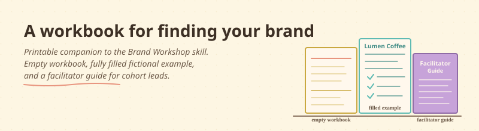

<div align="center">



</div>

# A workbook for finding your brand

> A printable companion to the [Brand Workshop skill](../../skills/brand-workshop/). An empty workbook to fill in by hand or by Claude. A fully filled fictional example so you can see what good looks like. A facilitator guide for cohort leads running the workshop with a group.

## What this is, in plain English

You are about to define your brand's DNA — who you serve, why you exist, how you win, what you will not do. The Claude Code skill walks you through that conversation in your own files. These resources are the paper-first, share-with-others, run-it-with-a-group version of the same thing.

Three files, three jobs:

- **An empty printable workbook.** Print it, fill it in with a pen at a coffee shop, scan it back. Or print it for a live cohort session and watch eight founders fill it at the same time.
- **A fully filled example for a fictional brand.** Lumen Coffee Roasters does not exist. The brand was made up to show what a finished workbook looks like end-to-end — including the optional Catalyst 17 Values and Brand Movement layers.
- **A facilitator guide.** For cohort leads, accelerator program managers, and mentors running the workshop with 4 to 20 founders. Four format options (half-day, two evenings, eight-week, async + check-ins), session-by-session timing, common stuck-points and how to unstick them.

## Who is this for?

- Founders who prefer pen and paper to a screen.
- Cohort leads running the workshop in a live session.
- Sceptical founders who want to see what a finished output looks like before committing 90 minutes.
- Anyone who wants the workshop in a format you can hand to a co-founder, a designer, or a board member who does not use Claude Code.

You do not need a marketing background. You do not need to know what "Roger Martin" means. The workbook (and the facilitator guide) explain every term in a sentence with an example.

## What you need before using it

- A modern browser (Chrome, Firefox, Safari, Edge — anything from the last few years).
- A printer if you want paper. The workbook is laid out for clean A4 / Letter printing.
- About 90 minutes per founder, or one focused half-day session for a cohort.

## How to install it (2 steps)

**Step 1.** Open the file you want in your browser:

```
resources/brand-workshop/workbook.html              ← empty printable
resources/brand-workshop/workbook-filled-example.html ← Lumen Coffee filled
resources/brand-workshop/facilitator-guide.md       ← for cohort leads
```

**Step 2.** Print, fill in, share. That is it. No dependencies, no build step.

If you want the digital walk-through, install the [Brand Workshop skill](../../skills/brand-workshop/) instead — same content, conversational, file-based.

## What is in it

| File | What you find there |
|---|---|
| **`workbook.html`** | An empty printable workbook with all 14 exercises: stakeholders, needs (Functional / Emotional / Social), purpose archetype tickboxes, long-form purpose Mad Libs, purpose words, short purpose sentence, superpower triad, strategic cascade (5 cells), strategic pillars, origin story, customer transformation, brand IS / IS NOT, central tension, will-not-do. Optional Catalyst 17 layers (values + brand movement) included. |
| **`workbook-filled-example.html`** | The same workbook, fully filled for fictional **Lumen Coffee Roasters**. Use it as a "what good looks like" reference. |
| **`facilitator-guide.md`** | A guide for cohort leads. Four session formats, timing, plenary moves, common stuck-points and how to unstick them. |

## What using it looks like

**Solo founder, paper-first:**

1. Print `workbook.html`. Take it to a quiet morning at a coffee shop.
2. Fill in pen by pen. Skip what does not fit; come back to it later.
3. When done, type the answers into Claude (or have someone type them) and run `/brand-export` from the skill to get a printable HTML deck.

**Cohort facilitator, live session:**

1. Print one workbook per founder.
2. Read the facilitator guide. Pick a format (half-day intensive is the most common).
3. Run the session. Use the filled Lumen example for one minute at the start: "this is what a finished workbook looks like."
4. Founders walk out with a draft they can refine over the next week.

**Sceptical founder, before committing:**

1. Open `workbook-filled-example.html` in your browser.
2. Read it end to end. About 8 minutes.
3. Decide if you want to do this for your own brand.

## Customize it

The empty workbook is generic. Anywhere it asks for a stakeholder, a need, an archetype — write yours. The framework is the structure; your brand is the content.

If you fork this for an industry-specific run (cohorts of solo lawyers, cohorts of restaurant owners, etc.), you can:

- Pre-fill the **Stakeholders** section with the typical 8–10 stakeholders for that industry, so founders only need to pick top 3.
- Add **industry-specific examples** under each archetype.
- Change the visual brand colours of the workbook to match your cohort.

## Make it yours

- **Translate.** If your founders are not in English, translate the workbook. The 14 exercises are universal; the language is not.
- **Add a 15th exercise.** If your community has a discipline the public method does not cover (e.g., go-to-market, pricing, fundraising posture), add a section. Keep the 14 above intact for cross-cohort comparability.
- **Re-skin for your accelerator.** The HTML is plain CSS. Change colours, fonts, logo. The substance is the structure.
- **Print and bind.** A nicely bound 14-exercise workbook is the kind of artefact a cohort founder keeps on their desk for a year.

## Credit

**Brand DNA workshop method:** [Barry Hillier](https://www.barryhillier.com/) (Hillier Consulting) and Brian Hickling (Catalyst 17). The exercise sequence and language are theirs. The Brand DNA workshop is a public method they have been teaching to founders and cohorts.

**Strategic cascade:** Roger Martin and A.G. Lafley, *Playing to Win*. The five-cell exercise in the workbook uses their five-question framework.

**Six adjacent exercises** (origin story, customer transformation, brand IS / IS NOT, central tension, will-not-do, confidence calibration): added by the contributor as common founder-brand patterns.

**Lumen Coffee Roasters fictional example:** drafted to show what a finished workbook looks like. The brand does not exist.

**License:** MIT. Free to use, modify, share. If you build a localized version (other languages, other industries), open a Pull Request — we would love to collect them in this folder.

## A note on visuals

The workbook uses warm earth-tone colours because the brand-workshop palette pairs cleanly with handwritten ink. Feel free to fork and re-skin in your own brand. The structure and content are the substance; the colours are decoration.
