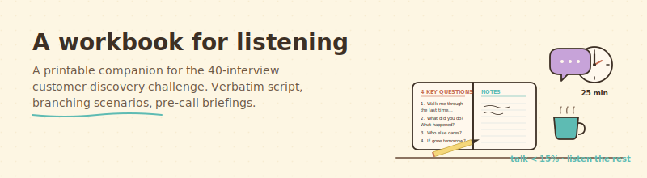

<div align="center">



</div>

# A workbook for listening

> A printable companion for running the 40-interview customer discovery challenge from Rob Kenedi's masterclass. Verbatim script. Branching scenarios. Pre-call briefing template. All in one HTML file you can open in a browser or print.

## What this is, in plain English

You are about to call 40 prospective customers and ask them four questions. Most of those calls will not go the way you planned. Someone will refuse to be recorded. Someone else will treat your "research call" like a sales pitch. Someone else will give you a long monologue you cannot follow. Someone else will say "we already use [their existing tool]" and you will not know what to say next.

This workbook gives you the exact words to say in each of those moments. It is built around Rob Kenedi's framework (vitamins / painkillers / gaping neck wounds, the 4 key questions, the 8-persona model, the 15 percent talk rule), with the verbatim script and branching scenarios filled in.

It is sanitized — anywhere it says `[YOUR PRODUCT]`, you fill in your own.

## Who is this for?

- Anyone running discovery interviews and wishing they had a friendly script in their hand.
- Cohort founders working through Rob Kenedi's 40-interview challenge.
- People who have read *The Mom Test* and want a workbook that turns the principles into actual call structure.
- Anyone who needs a reminder, mid-call, of what to say when the conversation goes off-script.

## What you need before using it

- About an hour to read it end to end the first time.
- A printer (or a comfortable browser tab) for during calls.
- One real interview booked.

## How to install it (2 steps)

**Step 1.** Download the workbook:

```bash
git clone https://github.com/protectyr-labs/chaitech-ai-assistant.git
cd chaitech-ai-assistant/resources/discovery-interview-workbook
```

**Step 2.** Open `discovery-workbook.html` in your browser.

That is it. No build step. No dependencies. Tabs work in any modern browser.

## What is in it

The workbook has six tabs:

| Tab | What you find there |
|---|---|
| **Overview & Flow** | The 8-section, 30-minute call structure with talk percentages. The 3 discipline rules. The 3 levels of pain (vitamin / painkiller / gaping neck wound). |
| **The Verbatim Script** | Every line you say, including the recording-consent dance. Sub-dropdowns for "if they say YES" vs "if they say NO" vs "if they ask are you trying to sell me". |
| **Branching (If They Say...)** | About 15 specific scenarios with scripted reactions — no-show, hard stop, suspicious, send-me-a-proposal, want-to-buy-now, ghosted, and more. |
| **Pre-Call Briefings** | What a good briefing contains. A separate `briefing-template.md` is in this folder you can fill in per prospect. |
| **Build Your Top 50** | Chris Carder's exercise. Three pools: cold-with-data, warm network, LinkedIn 1st degree. |
| **Quick Reference** | Eight cards (Rob's 4 questions, the discipline rules, the 8 personas, vitamins/painkillers/wounds, etc.) printable on one page. |

When you print the workbook, all tabs print as separate sections. When you read on screen, you click between them.

## What using it looks like

Before the call:

1. Open `briefing-template.md`. Fill it in for the prospect (5 to 10 min).
2. Open the workbook in your browser. Switch to **The Verbatim Script** tab.
3. Open the prospect's LinkedIn in another tab. Skim their last 3 posts.

During the call:

1. Read the opening lines from Section 1 (verbatim).
2. Get verbal consent on recording. Start the recording.
3. Move through Sections 2 to 7.
4. When the prospect says something off-script, swipe to the **Branching** tab and find the matching scenario.

After the call:

1. Stop the recording.
2. Update your CRM row (stage, pain_level, validations).
3. Send the thank-you email within 2 hours.

## Customize it

Anywhere the script says one of these placeholders, fill in your own:

- `[YOUR PRODUCT]` — what you sell or are building.
- `[YOUR ROLE]` — your title and elevator description.
- `[YOUR INDUSTRY / DOMAIN]` — the world your buyer lives in.
- `[YOUR ICP]` — your ideal customer profile.
- `[YOUR PRIMARY PAIN]` — the specific pain your product solves.
- `[YOUR COMPETITORS / COMPLEMENTS]` — tools or services your prospects already use.

The 4 key questions, the 8-persona model, the discipline rules, and the call flow are universal. Do not change those. Customize the placeholders only.

## Make it yours

- **Industry-specific Q1 variants.** If you sell to lawyers, write a Q1 in legal language. If you sell to manufacturers, write one in ops language. Replace the generic Q1 with yours.
- **Branching scenarios specific to your category.** When prospects mention competitors you know well, add a branch with the right framing for each.
- **Custom briefing fields.** If your CRM tracks something useful (NPS, deal stage, prior touchpoints), add those fields to your briefing template.
- **Translate.** If your buyers are not in English, the framework still applies. The translation is the contribution.

## Credit

**Customer discovery framework:** [Rob Kenedi](https://decelerator.media), from his ChaiTech masterclass on customer discovery best practices. Vitamins / painkillers / gaping neck wounds, the 4 key questions, the 8-persona model, the 15 percent talk rule, "position yourself as a researcher" — all Rob.

**Script and branching scenarios:** Drafted by Sasha Madaniev, CISSP (Protectyr Security). Adapted from *The Mom Test* (Rob Fitzpatrick) and Challenger Sale practices.

**License:** MIT. Free to use, modify, share. Attribution appreciated, not required. If you ship a useful improvement, share it back so the cohort compounds the work.

## A note on visuals

The workbook uses Protectyr's brand colors (light turquoise) because that is who built it. Feel free to fork and re-skin in your own brand. The structure and content are the substance; the colors are decoration.
