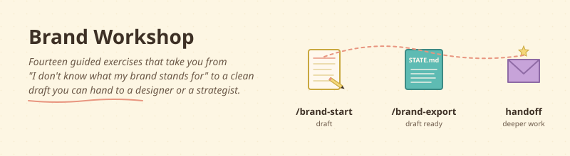

<div align="center">



</div>

# Find what your brand stands for

> Fourteen guided conversations that take you from "I don't really know what my brand stands for" to a clean markdown draft you can hand to a designer, a strategist, or your next hire.

## What this does, in plain English

You type `/brand-start` once. Claude greets you, opens a workbook file in your project folder, and walks you through fourteen short exercises. Each one is a real conversation, not a form. By the end you have:

- A list of who you really serve and what they need.
- A purpose statement you can defend to your board, your spouse, and your next hire.
- A strategic cascade (the five-choice frame from Lafley & Martin's *Playing to Win*) that says where you will play, how you will win, and what you will say "no" to.
- An origin story, a brand IS / IS NOT list, a central tension, and a "will not do" list — the things that make you specifically you.
- A printable HTML draft deck you can hand to a designer or paste into a pitch.

You can do the whole thing in one focused afternoon, or stretch it across a week. The state file remembers where you left off.

## Who is this for?

- Founders who keep trying to write a homepage and freezing on the first paragraph.
- Pre-launch entrepreneurs who have a product but no story.
- Established small businesses who outgrew their original positioning.
- Cohort programs that want a shared brand-strategy spine for their founders.

You do not need a marketing background. You do not need to know what "Roger Martin" means. The skill explains every term once, in a sentence, with an example.

## What you need before using it

- Claude Code installed. If you have not done that yet, [start here](../../README.md#where-do-i-start-if-i-have-never-done-this-before).
- A folder for your project (any folder is fine — even an empty one).
- About 90 minutes of focus, or two 45-minute sessions.

## How to install it (2 steps)

**Step 1.** Copy the skill files into your Claude Code config:

```bash
cp -r skills/brand-workshop ~/.claude/skills/
cp skills/brand-workshop/commands/*.md ~/.claude/commands/
```

**Step 2.** Open Claude Code in the folder where you want to keep the workbook. Type:

```
/brand-start
```

That is all. Claude will create `brand-workshop/STATE.md`, ask what to call your business, and start Exercise 1.

## What using it looks like

```
You: /brand-start

Claude: Welcome. Before we start — what are we calling this business
        in the workbook? It does not have to be the final name.

You: Lumen Coffee Roasters.

Claude: Got it. I created brand-workshop/STATE.md. Exercise 1 is
        Stakeholders — the people whose needs your brand answers.
        Want to do it now, or come back later?

You: Now.

Claude: Brilliant. Take a minute and list everyone you can think of.
        Customers, of course — but also employees, suppliers, the
        landlord, the city, your family, your investors. Cast wide.
        I will help you trim later.
```

…and so on, exercise by exercise. At the end:

```
You: /brand-export

Claude: Done. Open brand-workshop/DECK.html in your browser. It is
        ready to print, share with a designer, or take to your next
        brand-strategy session.
```

## The fourteen exercises

| # | Exercise | What you walk away with |
|---|---|---|
| 1 | Stakeholders | A clear top 3 of the people your brand serves. |
| 2 | Needs (Functional / Emotional / Social) | What each stakeholder needs to *do*, *feel*, and *signal*. |
| 3 | Purpose Archetype | Which of five impact patterns fits you (Reduce Friction, Foster Prosperity, Enable Potential, Encourage Exploration, Kindle Happiness). |
| 4 | Purpose Sentence (long form) | A defensible statement: we exist to / by / for / impact / sustainability. |
| 5 | Purpose Words | A word cloud, then a 3–7-word purpose sentence you can repeat. |
| 6 | Superpower | The intersection of what the world needs, what you are gifted at, and what you love. |
| 7 | Strategic Cascade | Roger Martin's five questions: aspiration → where → how → capabilities → systems. |
| 8 | Strategic Pillars | The 3–4 things you must keep doing to live your purpose. |
| 9 | Origin Story | The moment, frustration, or insight that started this. |
| 10 | Customer Transformation | The before / after / unlock for your top stakeholder. |
| 11 | Brand IS / IS NOT | A dual list — the IS NOT side does most of the work. |
| 12 | Central Brand Tension | The productive tension your brand navigates, with a position on it. |
| 13 | What We Will NOT Do | Three to five explicit boundaries. |
| 14 (optional) | Values + Brand Movement | Brian Hickling's Catalyst 17 layer, for purpose-driven brands. |

## Make it yours

- **Skip exercises.** If you already have a clear purpose, jump straight to `/brand-cascade`. The skill works on whichever sections you fill.
- **Branch the workbook.** Want to test two different positionings side by side? Copy `brand-workshop/STATE.md` to `brand-workshop/STATE-v2.md` and re-run.
- **Edit the deck template.** `templates/brand-deck.html` is plain HTML and CSS. Change colors, fonts, layout. Make it look like your brand.

## Where this skill stops

The skill stops at "draft ready." It does not include archetype work, voice and tone calibration, brand architecture decisions, governance, or AI synthesis. Those layers belong to the deeper Brand DNA work — most concretely, *Find My Brand DNA* by Hillier Consulting, or working directly with Barry. The exported deck points you there.

## Credit

- **Barry Hillier** — Hillier Consulting. Workshop co-author. [barryhillier.com](https://www.barryhillier.com/)
- **Brian Hickling** — Catalyst 17. Workshop co-author. The optional Values and Brand Movement layers come from his published thinking.
- **Roger Martin & A.G. Lafley** — *Playing to Win*. The strategic cascade in Exercise 7 uses their five-question framework.
- **Simon Sinek** — *Start with Why*. Background lineage for the purpose work.
- **ChaiTech Cohort 7** — for the willingness to try AI-augmented strategy work in a live cohort.

The Brand DNA workshop is the public method by Barry and Brian. This skill is the open-source companion that lets you draft offline, exercise by exercise, in your own files. It is not the full method — for the deeper layers, work with Barry directly or use *Find My Brand DNA*.
