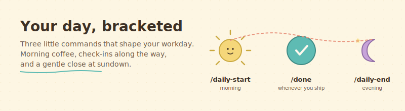

<div align="center">



</div>

# Your day, bracketed

> Three little commands that shape your workday. No calendar, no task app, no account to create.

## What this does, in plain English

This helper adds three commands to Claude Code. You type them, Claude responds, and a small text file in your project keeps track of what happened today.

- **`/daily-start`** in the morning. Claude greets you, reminds you what you did not finish yesterday, and asks what today's focus is.
- **`/done`** whenever you finish a piece of work. Claude logs it with the time and suggests what to do next.
- **`/daily-end`** in the evening. Claude wraps up the day and asks what tomorrow's seed is.

That is it. No setup, no integrations, no accounts.

## Who is this for?

- Founders who want structure but hate task apps.
- Anyone who would benefit from a friendly nudge at the start and end of the day.
- People who like the idea of a log they can grep through later.

## What you need before using it

- Claude Code installed. (If you have not done this yet, see [the main page](../../README.md#where-do-i-start-if-i-have-never-done-this-before).)
- About five minutes.

## How to install it (2 steps)

**Step 1.** Copy the three commands into your Claude Code folder:

```bash
cp -r skills/daily-rhythm/commands/* ~/.claude/commands/
```

**Step 2.** Tomorrow morning, open Claude Code and type `/daily-start`. That is all.

The helper writes its own log file at `daily-log/YYYY-MM-DD.md` the first time you use it.

## What using it looks like

Morning:

> **You:** `/daily-start`
>
> **Claude:** Good morning. Yesterday you had two things carry over: finish the pricing deck, and email Acme about Q2 renewal. What is today's focus?
>
> **You:** Finish the pricing deck and ship one email to Acme.
>
> **Claude:** Logged. I wrote the morning section to `daily-log/2026-04-22.md`.

Midday:

> **You:** `/done finished pricing deck v2`
>
> **Claude:** Nice. Logged at 11:04. Next suggested: email Acme about Q2 renewal. Want to start on it?

Evening:

> **You:** `/daily-end`
>
> **Claude:** Here is today. You shipped the pricing deck and the Acme email. Nothing carries over. What is tomorrow's seed?
>
> **You:** Review Acme's reply before noon.
>
> **Claude:** Written. See you tomorrow.

## Make it yours

- **Change the file location.** If you want the log in a different folder, edit the `daily-log/` path in each of the three command files.
- **Add your own categories.** The evening wrap-up has three default fields (what shipped, what carries over, tomorrow's seed). Add "wins" and "blockers" if you like.
- **Wire it to your task app later.** If you eventually want this to sync with Linear, Jira, or Notion, you can. But you do not have to. Most founders do not.

## Credit

A stripped-down, generic version of the daily workflow used at Protectyr Security. The original is tied to Jira and a persona system; this public version is intentionally minimal so anyone can use it.
