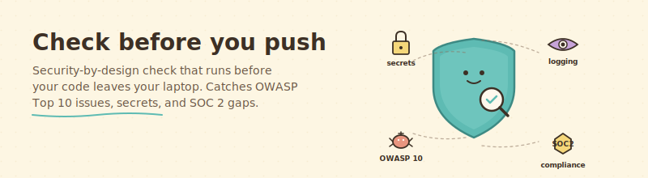

<div align="center">



</div>

# Check before you push

> A gentle security reviewer that looks at your pending changes and tells you what would break, what would leak, and what would make a future audit painful.

## What this does, in plain English

Right before you push your code to GitHub, you type `/secure-before-push` in Claude Code. Claude looks at everything you are about to send, checks it against a careful list of common security mistakes, and tells you:

- **STOP** — here are the issues you need to fix first. (Leaked password, missing auth check, plain-text secret.)
- **THINK** — these probably are fine, but you should decide consciously. (Logging gap, unusual permission, debug setting.)
- **NICE** — here is what you got right. A short compliment, if warranted.

If everything is clean, you get a green light and push with confidence.

## Who is this for?

- Founders building something public-facing who do not have a security engineer on staff.
- Anyone preparing for a SOC 2 audit who wants to catch issues early instead of at audit time.
- Anyone whose gut says "I should probably double-check this before it goes up" but is not sure what to check.

## What you need before using it

- Claude Code installed.
- A git repository with changes to review (staged or unstaged).
- A little patience for the first run. The check is thorough.

## How to install it (2 steps)

**Step 1.** Copy the skill into your Claude Code folder:

```bash
cp -r skills/secure-before-push ~/.claude/skills/
cp skills/secure-before-push/commands/secure-before-push.md ~/.claude/commands/
```

**Step 2.** In your project, right before you commit or push, type:

```
/secure-before-push
```

Claude does the rest.

## What using it looks like

```
> /secure-before-push

SECURE-BEFORE-PUSH RESULTS

Verdict: WARN

BLOCK findings:
  (none)

WARN findings:
  - src/api/login.ts:42
    A07 Authentication Failures
    The new /login endpoint has no rate limiting.
    Consider adding a per-IP rate limit (5 attempts / 5 min) before merge.

  - src/routes/admin.tsx:15
    A01 Broken Access Control
    The new /admin/users page has no explicit role check.
    Add requireRole("admin") at the top of the handler.

SOC 2 annotations:
  - src/api/login.ts:42
    CC7.2 Monitoring
    Failed login attempts are not currently emitted as a metric.
    For an audit, the reviewer will ask for a dashboard of failed logins.
    Consider adding a simple metrics.increment call.

Summary: Two auth concerns worth addressing before this reaches production.
Nothing here blocks the push, but the admin route should get a role check in
the same PR.
```

You read that. You fix the admin route. You run `/secure-before-push` again. It says PASS. You push.

## What it checks (full list)

<details>
<summary>OWASP Top 10 (2021) — click to expand</summary>

1. **A01 Broken Access Control.** New routes without authorization checks.
2. **A02 Cryptographic Failures.** Weak hashing (MD5, SHA1), plain-text sensitive data, non-HTTPS for sensitive operations.
3. **A03 Injection.** SQL string concatenation, shell commands from user input, eval on user input.
4. **A04 Insecure Design.** Missing rate limiting, weak password reset flows, sessions that do not rotate.
5. **A05 Security Misconfiguration.** Debug mode on, CORS wide open, missing security headers, default credentials.
6. **A06 Vulnerable Components.** Known-vulnerable package versions.
7. **A07 Authentication Failures.** Missing MFA on privileged actions, unset session timeouts, weak password rules.
8. **A08 Integrity Failures.** Unsigned installs, untrusted deserialization, CI without commit verification.
9. **A09 Logging and Monitoring Failures.** Sensitive actions with no audit log, logs that include secrets, missing correlation IDs.
10. **A10 Server-Side Request Forgery.** Fetch calls where the URL is user-controlled without an allowlist.

</details>

<details>
<summary>Secret scan — click to expand</summary>

- AWS keys (`AKIA...`, `ASIA...`)
- GitHub tokens (`ghp_`, `gho_`, `ghu_`, `ghs_`, `ghr_`)
- Stripe keys (`sk_live_`, `sk_test_`, `pk_live_`)
- Slack tokens (`xoxb-`, `xoxp-`, `xoxa-`)
- Generic: `password = "..."`, `api_key = "..."`, `secret = "..."`
- Private keys (RSA, OpenSSH)
- Connection strings with embedded passwords

Secret findings always get a BLOCK verdict. The skill never prints the actual
secret value; it redacts to `<value-redacted>`.

</details>

<details>
<summary>SOC 2 relevance — click to expand</summary>

The skill flags patterns that would come up in a future SOC 2 audit. These do
not block the push; they are notes for your future self:

- **Access control (CC6).** New admin action without an audit log entry.
- **Encryption (CC6.7, CC6.8).** Sensitive data stored without encryption at rest. Network calls without TLS.
- **Change management (CC8.1).** Production config changes without a clear "why" in the commit message.
- **Monitoring (CC7.2).** Exceptions silently swallowed. Abuse-indicator metrics absent.
- **Data retention (CC3.1).** New places where user data lives without a retention policy.

</details>

## What it does not do

- It does not replace a penetration test.
- It does not replace `npm audit`, `pip-audit`, or similar dependency scanners. Run those too.
- It does not audit the entire history of your repo. Only the pending changes.
- It does not commit or push for you. The skill informs; you act.

## Credit

Authored for the ChaiTech AI Assistant seed by Alexander Madaniev, CISSP, Cohort 7. The checklist is grounded in [OWASP Top 10 (2021)](https://owasp.org/Top10/) and [SOC 2 Common Criteria (2017 TSC, 2022 revision)](https://www.aicpa-cima.com/resources/download/2017-trust-services-criteria-with-revised-points-of-focus-2022).
